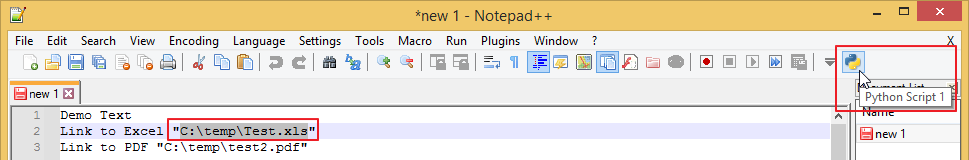

# Tips And Tricks

## Tools

|Tool|Beschreibung|Lizenz|
|-|-|-|
|[AnyDesk](src/Tools/AnyDesk/AnyDesk.md) |Fernwartungs-Software |private Anwendung kostenlos |
|[Autoruns](src/Tools/Autoruns/Autoruns.md) |Windows-Tool alternativ zu Msconfig |EULA (proprietär) |
|[Avast Free Antivirus](src/Tools/Avast_Antivirus/Avast_Antivirus.md) |Antivirus |Freeware, proprietary software |
|[Beyond Compare](src/Tools/Beyond_Compare/Beyond_Compare.md) |Datenvergleichsprogramm |proprietär |
|[Classic Shell / Open Shell Menu](src/Tools/Classic_Shell/Classic_Shell.md) |Windows Startmenü |MIT-Lizenz |
|[DAEMON Tools Lite](src/Tools/DAEMON_Tools_Lite/DAEMON_Tools_Lite.md) |Emulieren optischer Laufwerke |proprietär; Freeware (bis 3.47; seit 4.30.0); Adware (freiwillig, 4.0 – 4.12.4) |
* [Database4](src/Tools/Database4/Database4.md)
* [dotPeek (JetBrains)](src/Tools/dotPeek/dotPeek.md)
* [EasyBCD 2.2](src/Tools/EasyBCD/EasyBCD.md)
* [Fiddler4](src/Tools/Fiddler/Fiddler.md)
* [FileZilla](src/Tools/FileZilla/FileZilla.md)
* [Foxit Reader](src/Tools/Foxit_Reader/Foxit_Reader.md)
* [Gimp](src/Tools/Gimp/Gimp.md)
* [ImgBurn](src/Tools/ImgBurn/ImgBurn.md)
* [IrfanView](src/Tools/IrfanView/IrfanView.md)
* [JustDecompile](src/Tools/JustDecompile/JustDecompile.md)
* [KeePass](src/Tools/KeePass/KeePass.md)
* [LICEcap](src/Tools/LICEcap/LICEcap.md)
* [LockHunter](src/Tools/LockHunter/LockHunter.md)
* [Notepad++](src/Tools/Notepad++/Notepad++.md)
* [Paint.NET](src/Tools/Paint.NET/Paint.NET.md)
* [PFMAP Pismo File Mount Audit Package](src/Tools/PFMAP/PFMAP.md)
* [PicPick](src/Tools/PicPick/PicPick.md)
* [PuTTY](src/Tools/PuTTY/PuTTY.md)
* [Qemu](src/Tools/Qemu/Qemu.md)
* [Rufus](src/Tools/Rufus/Rufus.md)
* [Skype](src/Tools/Skype/Skype.md)
* [SysinternalsSuite](src/Tools/SysinternalsSuite/SysinternalsSuite.md)
* [TeamViewer](src/Tools/TeamViewer/TeamViewer.md)
* [Total Commander](src/Tools/Total_Commander/Total_Commander.md)
* [UNetbootin](src/Tools/UNetbootin/UNetbootin.md)
* [VirtualBox](src/Tools/VirtualBox/VirtualBox.md)
* [Visual Studio Code](src/Tools/VisualStudioCode/VisualStudioCode.md)
* [VNC-Viewer](src/Tools/VNC-Viewer/VNC-Viewer.md)
* [WinMerge](src/Tools/WinMerge/WinMerge.md)
* [WinSCP](src/Tools/WinSCP/WinSCP.md)
* [7-Zip File Manager](src/Tools/7-Zip/7-Zip.md)

## Notepad++

### Open File
* Plugins - install "Python Script"
* Add "[OpOpenFile.py](src/Notepad++/Python_Script/OpOpenFile.py)" to:
* %APPDATA%\Notepad++\plugins\config\PythonScript\scripts
* Plugins - "Python Script" - Configation... - (o) User Scripts - select OpOpenFile.py - Add Toolbar icons
* Now you can mark a FileName and Click to "Python Script 1" in the Toolbar, then the File is opened with the default Program (Excel, Pdf-Viewer, ...)

## Windows
### Make Backup-Image and Recovery-CD/USB
Windows 7  
Windows 8.1  
Windows 10
